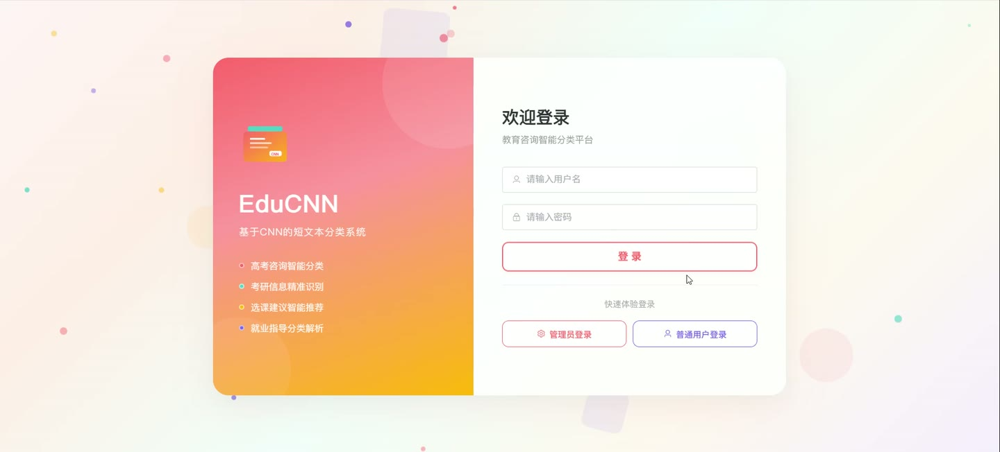
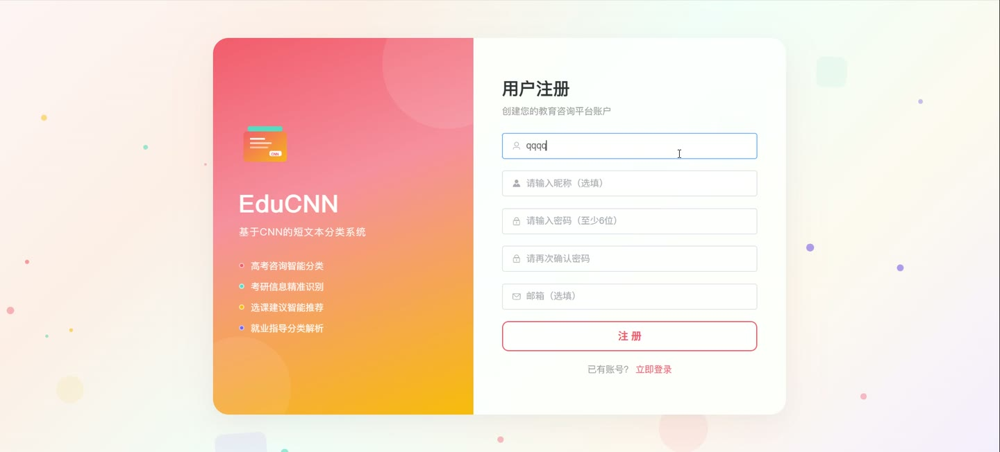
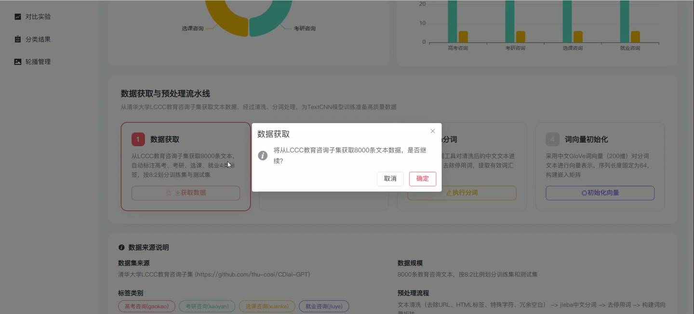
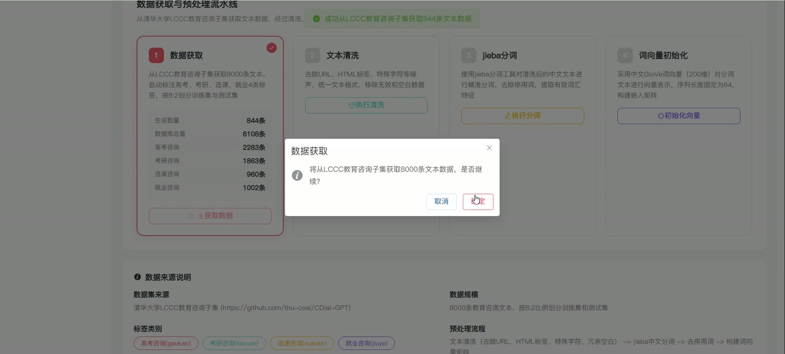

# (附文档)Python+Django+Vue3 基于CNN的短文本分类研究与实现（教育咨询方向）

**技术栈**：Python、Django、Vue3、MySQL

### 系统简介

本系统是基于 Django + Vue3 前后端分离架构的 CNN 短文本分类平台，面向教育咨询场景，对高考、选课、就业四类咨询文本进行智能分类。系统包含普通用户端与管理员端两类角色，后端提供 RESTful 接口，前端为单页应用，数据存储于 MySQL。
 
### 核心功能
 
### 普通用户端

 
- 用户注册：填写用户名、密码、昵称、邮箱，校验用户名 3-20 字符、密码不少于 6 位、用户名唯一。 
- 用户登录：输入用户名与密码登录，校验密码 MD5 与账户状态，禁用账户返回 403 提示。 
- 快速体验登录：一键以普通用户身份登录，免去手动输入账号密码。 
- 首页轮播展示：读取启用状态的轮播图，展示标题、描述、图片与跳转链接。 
- 文本智能分类：输入教育咨询文本，提交后返回预测类别、置信度、各类别置信度分布。 
- 查看模型信息：分类结果中展示 TextCNN 模型名称、GloVe 200 维嵌入、3/5/7 卷积核、64 过滤器、ReLU、Dropout 0.3、Adam 优化器等参数。 
- 查看关联问答：分类完成后按预测类别返回最多 5 条相关咨询问答，含问题与回答内容。 
- 咨询问答浏览：按分类筛选查看咨询问答列表，展示问题、回答与浏览次数。 
- 关于页面：查看平台介绍信息。 
- 退出登录：清除本地登录状态并跳转登录页。
 
### 管理员端

 
- 仪表盘统计：展示用户数量、文本数据量、分类次数、训练模型数、咨询问答数等核心指标。 
- 数据分布图表：以饼图展示各类别文本数据分布，以柱状图对比各模型准确率与 F1 值。 
- 最近分类记录：查看最近 5 条分类结果，含输入文本、预测分类、置信度与时间。 
- 用户管理：按用户名或昵称关键字、角色筛选用户列表，支持新增、编辑、删除用户，密码自动 MD5 加密。 
- 类别管理：新增、编辑、删除文本分类类别，维护名称、编码、描述、展示颜色、图标与排序。 
- 文本数据管理：按关键字与分类筛选文本数据，新增、编辑、删除数据，标记数据来源与训练集/测试集归属。 
- 数据预处理流水线：依次执行数据获取、文本清洗、jieba 分词、词向量初始化四步操作，每步返回处理数量与结果。 
- 预处理统计：查看文本总量、训练集与测试集数量，以及各类别训练集/测试集分布图表。 
- 分词结果查看：展示原文、清洗后文本、分词词汇列表与词数统计。 
- 词向量初始化结果：展示词向量维度、序列长度、词汇表大小、嵌入矩阵形状、GloVe 匹配词数、高频词 Top20 与序列向量化示例。 
- 模型构建：配置并构建 TextCNN 分类模型。 
- 模型训练：执行模型训练并记录模型名称、准确率、损失值、轮次、批次大小、学习率、Dropout、卷积核尺寸与训练耗时。 
- 对比实验：运行多模型对比实验，记录各模型准确率、精确率、召回率与 F1 值。 
- 训练记录管理：查看与删除训练记录，跟踪训练状态与备注。 
- 分类结果管理：按关键字筛选分类结果列表，查看输入文本、预测分类与置信度，支持删除。 
- 轮播图管理：新增、编辑、删除轮播图，维护标题、描述、图片地址、链接、排序与启用状态，支持本地上传图片。 
- 文件上传：上传图片文件至服务器，返回可访问的图片地址。
 
### 技术栈

 后端框架Python + Django + Django REST Framework ORMDjango ORM（模型 managed=False 映射既有数据表） 认证与权限自定义 MD5 密码校验 + Token 生成，前端路由守卫控制后台访问 前端框架Vue3（组合式 API，script setup） 前端路由Vue Router（createWebHistory，含登录鉴权守卫） UI 组件库Element Plus 图表库ECharts（饼图、柱状图） 构建工具Vite 数据库MySQL 核心算法TextCNN 短文本分类，GloVe 200 维词向量，jieba 中文分词
 
### 交付内容

 
- 后端完整源码 
- 前端完整源码 
- 数据库初始化脚本 
- 万字文档

## 界面展示

---

## 获取完整源码 + 万字文档

本仓库为项目介绍页。**完整前后端源码、数据库初始化脚本、万字项目文档**，请加微信 `kangkangcode`，或访问 [codekk.top](http://codekk.top) 获取。

可作课程设计 / 毕业设计参考，支持远程部署调试。